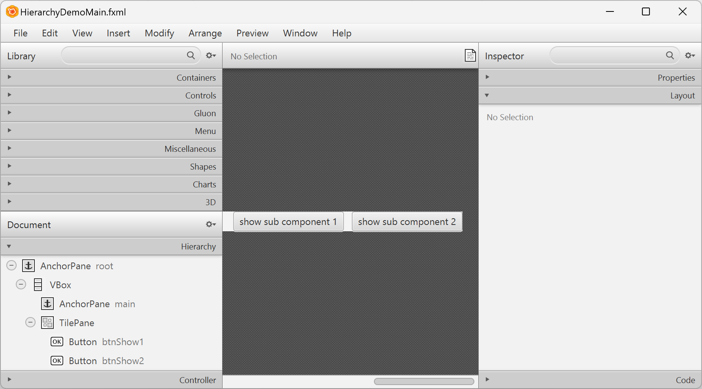

[back](./fx-comp-architecture.md)

If you are interested in how to use CDI based IOC with FX Comp you might want to skip to [an example](#fx-comp-demo---composing-applications-from-a-hierarchy-of-fx-comp-components)

## FX Comp Demo - Empty

This application demonstrates how to get a minimal FX Comp driven application up and running with minimum effort. Many times it is sufficient to simply subclass from classes defined by FX Comp architecture.

### View

The class definition for the component's view below is empty except for the extends clause. By extending ```DefaultFXCView``` a complete default implementation for ```FXCView``` is available immediately.

```
package de.ruu.lib.fx.comp.demo.empty;

import de.ruu.lib.fx.comp.DefaultFXCView;

public class Empty extends DefaultFXCView { }
```

### Controller

Same as the view class definition the controller definition is also (nearly) empty. Extending an empty ```DefaultFXCViewController``` does not bring in many functionality but helps to tie the controller to the corresponding view via internal mechanisms in ```DefaultFXCView```. This results in having a valid match of view and controller without further ado.

```
package de.ruu.lib.fx.comp.demo.empty;

import de.ruu.lib.fx.comp.FXCViewController.DefaultFXCController;
import javafx.fxml.FXML;

class EmptyController extends DefaultFXCViewController
{
	@Override @FXML protected void initialize() { }
}
```

### App

No surprise here either: To start up a Java FX application that runs a FX Comp component it's sufficient to subclass from FX App.

```
package de.ruu.lib.fx.comp.demo.empty;

import de.ruu.lib.fx.comp.FXCApp;

public class EmptyApp extends FXCApp { }
```

## FX Comp Demo - Composing Applications from a hierarchy of FX Comp components

This chapter describes a simple scenario where two FXComp components are composed to build a third FXComp component.

### Layout - Create and Maintain FXML configuration with visual editor

The picture below shows a very simple layout configuration. There are two buttons and a Java FX ```AnchorPane``` 
called main.



### Controller

The following code shows, how action methods (```onBtnShow1```, ```onBtnShow2```) repopulate the Java FX ```AnchorPane``` ```main with``` a new Java FX components (```sub1``` and ```sub2```).

Note the elegance of how Java FX controller classes can make use of two different versions of inversion of control (IOC): Java FX loader takes care of initialisation for all relevant Java FX controls and containers while CDI manages the instance values of custom FX Comp components such as ```sub1``` and ```sub2```.

```
package de.ruu.lib.fx.comp.demo.hierarchy;

import de.ruu.lib.fx.comp.FXCViewController.DefaultFXCController;
import de.ruu.lib.fx.comp.demo.hierarchy.sub1.HierarchyDemoSub1;
import de.ruu.lib.fx.comp.demo.hierarchy.sub2.HierarchyDemoSub2;
import jakarta.inject.Inject;
import javafx.event.ActionEvent;
import javafx.fxml.FXML;
import javafx.scene.control.Button;
import javafx.scene.layout.AnchorPane;
import javafx.stage.Stage;
import lombok.extern.slf4j.Slf4j;

@Slf4j
public class HierarchyDemoMainController extends DefaultFXCViewController
{
	@FXML private AnchorPane root;
	@FXML private AnchorPane main;
	@FXML private Button btnShow1;
	@FXML private Button btnShow2;

	@Inject private HierarchyDemoSub1 sub1;
	@Inject private HierarchyDemoSub2 sub2;

	@Override @FXML protected void initialize()
	{
		main.getChildren().add(sub1.getLocalRoot());
		
		btnShow1.setOnAction(e -> onBtnShow1(e));
		btnShow2.setOnAction(e -> onBtnShow2(e));
	}

	private void onBtnShow1(ActionEvent e)
	{
		main.getChildren().removeAll(main.getChildren());
		main.getChildren().add(sub1.getLocalRoot());
	}

	private void onBtnShow2(ActionEvent e)
	{
		main.getChildren().removeAll(main.getChildren());
		main.getChildren().add(sub2.getLocalRoot());
	}
}
```

[back](./fx-comp-architecture.md)