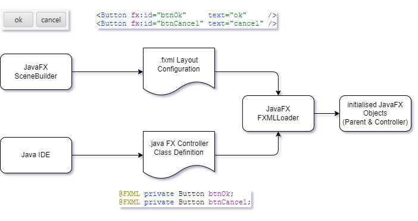

# FX Comp

FX Comp is a software architecture proposal for building complex Java FX applications. It provides a software 
framework that supports implementing this architecture and comes with tools for generating artifacts that adhere to it.

To explain some of the challenges when developing bigger applications with Java FX here is a brief overview of how Java 
FX works.

## Some basic mechanics of Java FX - FXML and Scenebuilder

Java FX is a UI framework that supports comfortable design of modern, feature rich user interfaces with a visual design 
tool named SceneBuilder. SceneBuilder is a WYSIWYG editor that produces configuration files (.fxml) for load-time
creation of an application's UI layout. Note that with FXML it is possible to design large parts (if not all) of the
visual appearance of an application visually.

In Java FX application logic can be decoupled strictly from layout using FXML for the definition of the layout. At
runtime a so called ```FXMLLoader``` can be configured to use a custom controller object. Then ```FXMLLoader```
automatically injects references to relevant UI controls into the controller.

A controller is an instance of a regular Java class with ```@FXML``` annotated fields for each relevant UI control. 
With this and the JavaFX component injection mechanism "regular" classes can take control over the application's 
behaviour. Using this approach the definition of the UI behaviour can be cleanly separated from the design of the UI 
layout.

To make this work it is necessary to tell the loader which controls shall be bound to which controller fields. This is
easily done by giving a unique name to each relevant UI control in the visual designer and by making sure the controller
class has an equally named ```@FXML``` annotated field for each of the controls. The following code snippets show
examples for two buttons in a ```.fxml``` file and their corresponding fields in controller class.

FXML with two button controls:

```xml
<Button fx:id="btnOk"     text="ok" />
<Button fx:id="btnCancel" text="cancel" />
```

Java code for two button controls / fields:

```java
@FXML private Button btnOk;
@FXML private Button btnCancel;
```

In the diagram below the "information flow" in a typical JavaFX application is outlined.



## Challenges for Java FX application architecture

While with this mechanism layout configuration can be strictly decoupled from application code, the size of controller 
classes still grows very fast and the code quickly becomes hard to maintain and extend.

To accomplish this a typical approach is to decompose big classes into smaller ones that can be understood more 
easily. However, this is where the design of Java FX proves to be an obstacle initially.[^1]
[^1]: Adam Bien discusses structuring complex Java FX applications [here](https://www.oracle.com/technical-resources/articles/java/javafx-productivity.html).

### Many controllers for single layout configuration

First, by Java FX design there is a one-to-one correspondence between each layout configuration in a .fxml file and 
its associated controller class. Of course inside that controller class multiple other classes can be 
used but these could not easily benefit from injection of FX controls via ```FXMLLoader```. In addition, these 
classes would rather be coupled very tightly with the controller class what complicates overall maintenance and 
extension.

### Many controllers for many layout configurations

Second, there is no built-in concept in Java FX for cooperation of multiple (sub) parts of a user interface. This can 
certainly be solved in one way or another but there is a great chance of creating very tightly coupled systems with an unmanageable number of dependencies and without following a common strategy for the overall system design.

## Welcome FX Comp

This is where FX Comp comes in.

As the name suggests components play a central role in this approach. In **FX Comp** a component is a multi-part software building block for Java FX user interfaces that

- defines a **view type** that is used for composition of complex user interfaces,
- defines a strongly typed API in a **service type** that allows for direct inter component service calls,
- can send and receive custom **events** leveraging CDI and thereby allowing for loosely coupled component collaboration,
- has a **visual layout** configuration in a .fxml file and
- is an autonomous software building block that can easily be run as a standalone JavaFX application.

**FX Comp** takes care of plumbing together everything and provides easy bootstrapping.

**FX Comp Generator Tools** produce basic versions of above-mentioned artifacts. These are the usual starting points 
for further customisation and development. However, after initial generation each component can be run as Java FX 
application which is extremely useful for early user feedback and testing. You can find a more detailed description 
about these tools [here](../../gen/java/fx/comp/readme.md).

FX Comp architecture is designed for modularisation with JPMS to allow for advanced approaches to handling complexity in large Java FX applications. In general, it is possible to define, test and run each component in its own module. With JPMS modules strong encapsulation can be provided for FX Comp components.

You'll find a more in-depth explanation of the above concepts here:

[FX Comp Architecture](doc/fx-comp-architecture.md)

If you prefer getting your hands dirty directly have a look at the simplistic example:

[FX Comp Example](doc/fx-comp-demo.md)

[back](../../../README.md)