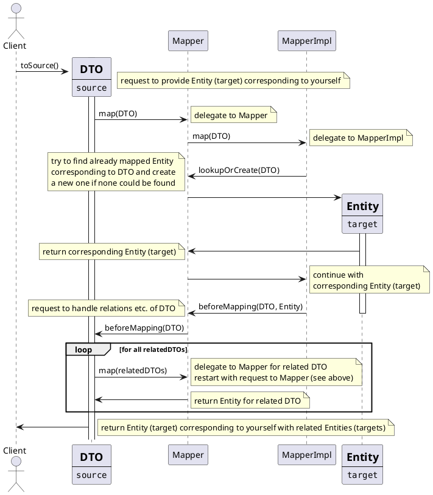

```plantuml
@startuml
actor Client
participant DTO [
    =DTO
    ----
    ""source""
]
create DTO
activate DTO
Client     -> DTO        : toSource()
note right               : request to provide Entity (target) corresponding to yourself
DTO        -> Mapper     : map(DTO)
note right               : delegate to Mapper
Mapper     -> MapperImpl : map(DTO)
note right               : delegate to MapperImpl
MapperImpl -> Mapper     : lookupOrCreate(DTO)
note left                : try to find already mapped Entity\ncorresponding to DTO and create\na new one if none could be found
participant Entity [
    =Entity
    ----
    ""target""
]
create Entity
Mapper     -> Entity
activate Entity
Entity     -> Mapper
note left                : return corresponding Entity (target)
Mapper     -> MapperImpl
note right               : continue with\ncorresponding Entity (target)
MapperImpl -> Mapper     : beforeMapping(DTO, Entity)
deactivate Entity
note left                : request to handle relations etc. of DTO
Mapper     -> DTO        : beforeMapping(DTO)
   loop for all relatedDTOs
      DTO     -> Mapper  : map(relatedDTOs)
      note right         : delegate to Mapper for related DTO\nrestart with request to Mapper (see above)
      Mapper  -> DTO     
      note right         : return Entity for related DTO
   end
DTO        -> Client
note right               : return Entity (target) corresponding to yourself with related Entities (targets)
@enduml
```