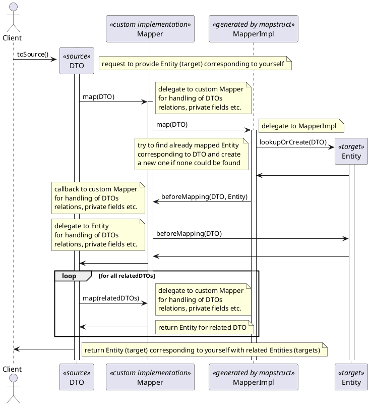

```plantuml
@startuml
actor Client
participant DTO <<source>>
create DTO
activate DTO
Client     -> DTO        : toSource()
note right               : request to provide Entity (target) corresponding to yourself
participant Mapper <<custom implementation>>
DTO        -> Mapper     : map(DTO)
activate Mapper
note right               : delegate to custom Mapper\nfor handling of DTOs\nrelations, private fields etc.
participant MapperImpl <<generated by mapstruct>>
Mapper     -> MapperImpl : map(DTO)
activate MapperImpl
note right               : delegate to MapperImpl
participant Entity <<target>>
create Entity
MapperImpl -> Entity     : lookupOrCreate(DTO)
note left                : try to find already mapped Entity\ncorresponding to DTO and create\na new one if none could be found
activate Entity
Entity     -> MapperImpl
MapperImpl -> Mapper     : beforeMapping(DTO, Entity)
note top                 : callback to custom Mapper\nfor handling of DTOs\nrelations, private fields etc.
Mapper     -> Entity     : beforeMapping(DTO)
note left                : delegate to Entity\nfor handling of DTOs\nrelations, private fields etc.
Entity     -> Mapper
Mapper     -> DTO
   loop for all relatedDTOs
      DTO     -> Mapper  : map(relatedDTOs)
      note right         : delegate to custom Mapper\nfor handling of DTOs\nrelations, private fields etc.
      Mapper  -> DTO     
      note right         : return Entity for related DTO
   end
DTO        -> Client
note right               : return Entity (target) corresponding to yourself with related Entities (targets)
@enduml
```