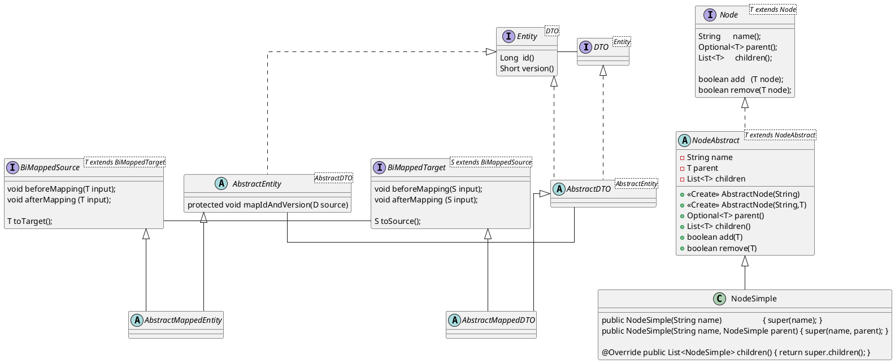

Package ```de.ruu.lib.jpa.core.mapstruct.demo.tree``` demonstrates a case where an interface type ```Node``` is the central abstraction for modelling an acyclic graph called tree in this context. ```Node``` has an abstract implementation named ```NodeAbstract``` that implements the business logic of ```Node```s. ```NodeSimple``` extends ```NodeAbstract``` as a simple but complete implementation and is intended for general use.

However, ```NodeSimple``` data has to be persisted in a database and be transferred to remote processes. Therefore ```NodeSimple``` is accompanied by a corresponding ```NodeEntity``` for JPA persistence as well as a ````NodeDTO``` type for data transfer via JAX-RS. Mapstruct is used to create ```NodeEntity``` and ```NodeDTO``` instances from ```NodeSimple``` objects and vice versa.

