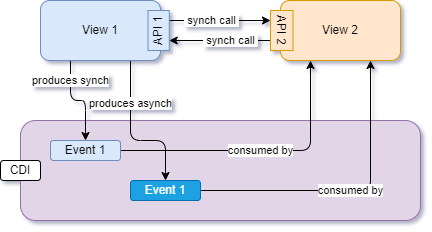

[back](../README)

## FX Comp Architecture - A Conceptual Overview

The following diagram shows, in a somewhat simplified way, central ideas behind the FX Comp Architecture from a user's (i.e. a developer's) point of view. For a FX Comp driven application there are several ways for inter component communication.



### View

In FX Comp the **view** type is a Java class that can be used to compose complex user interfaces. It provides a handle to the FX node graph that represents the visual appearance of a component and a method to retrieve access to the component's service methods. The behaviour of the component is defined "behind the scenes" by a custom controller class (see below).

FX Comp internally uses CDI to bootstrap all the required parts (e.g. the above-mentioned service and the controller instances). Thereby CDI is globally available in a FX comp based application.

### Service

A component in FX Comp provides access to custom services. For example an editor component for a customer might provide a ```Customer getInitialCustomerValue()``` and a  ```Customer getModifiedCustomerValue()``` method. Service methods are usually defined in Java interfaces. 

### Controller

The controller defines the behaviour of the component. It has access to all relevant visual controls. ```FXMLLoader``` achieves this by injecting values to controller fields annotated with ```@FXML``` at load time.

## FX Comp Architecture - A Detailed Technical Overview

FX Comp components are structured into a couple of collaborating Java types. In the following the collaboration is described in more technical detail.


In fact service calls as well as producing and consuming events is done in controller classes which are not shown in the diagram above. However, controllers do not depend on other view's controllers. Instead, they only depend on the interfaces of the views they collaborate with.

### Layout Configuration

FX Comp supports the use of layout configuration in .fxml files. Typically these are created using Gluon's excellent [SceneBuilder](https://gluonhq.com/products/scene-builder/).

[FX Comp Demo](fx-comp-demo.md)