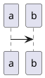

# no integration, plain markdown


# include local file puml
```plantuml
@startuml 2
!include integration-test.puml
@enduml
```

# include local file iuml
```plantuml
@startuml 3
!include integration-test.iuml
@enduml
```

# use url puml


# use url puml 2


# use url puml 3


# use url iuml


# use url iuml 2


# use url working example from elsewhere

