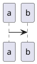

# no integration, plain markdown


# include local file puml
```plantuml 2
@startuml
!include integration-test.puml
@enduml
```

# include local file iuml
```plantuml 3
@startuml
!include integration-test.iuml
@enduml
```

# use url

